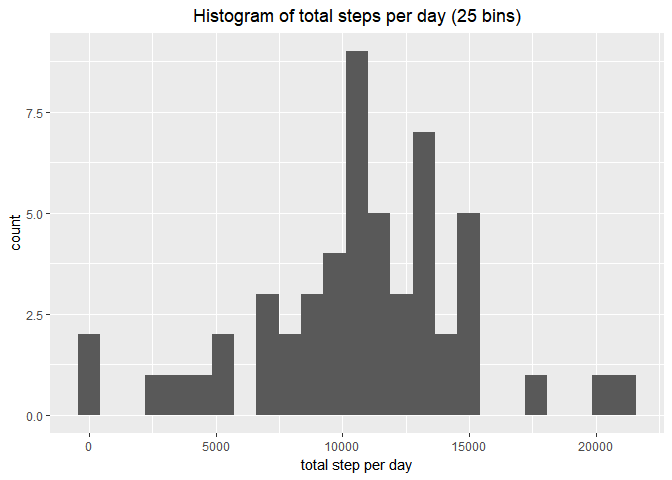
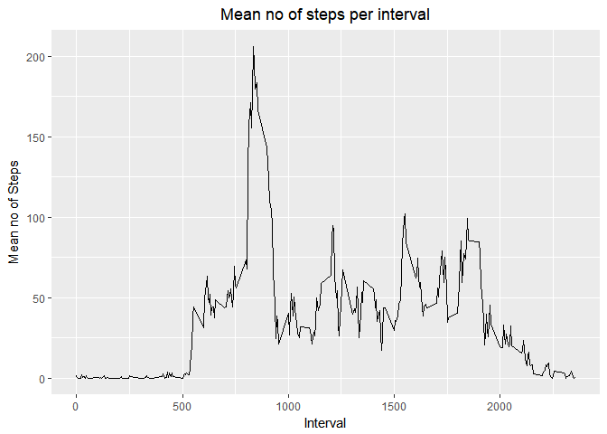
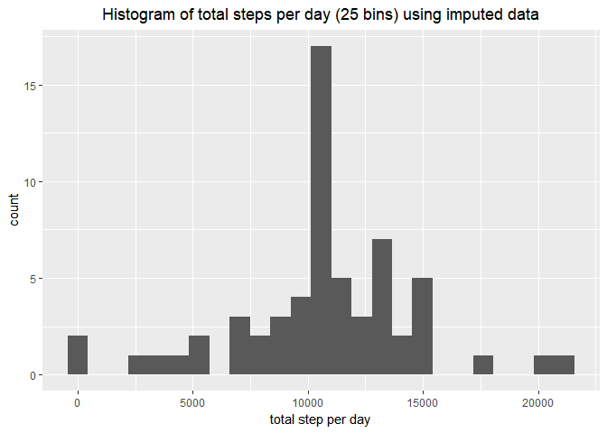
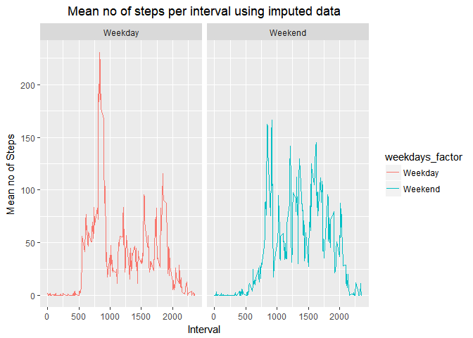

Reproducible\_Research\_Project1
================
Mohammadali Beheshti
September 15, 2017

``` r
library(knitr)
library(ggplot2)
library(dplyr)
```

set options for chunks:

``` r
opts_chunk$set(echo=TRUE,results=TRUE)
```

Loading and preprocessing the data
==================================

### 1. Load the data

``` r
dir<-getSrcDirectory(function(x) {x})
setwd(dir)
fileurl<-"https://d396qusza40orc.cloudfront.net/repdata%2Fdata%2Factivity.zip"
download.file(fileurl,destfile="dataset.zip")
unzip("./dataset.zip",overwrite=TRUE)
Activity<-read.csv("activity.csv")
```

### 2. Process/transform the data: Convert date dariable from Factor to Date

``` r
Activity$date<-as.Date(Activity$date,"%Y-%m-%d")
```

What is mean total number of steps taken per day?
=================================================

The missing values are ignored for this part

### 1. Histogram of the total number of steps taken each day

``` r
Activity_na_removed<- Activity[complete.cases(Activity),]
g<-group_by(Activity_na_removed,date)
tot_step_per_day<-summarize(g,tot_step=sum(steps))
P<-ggplot(tot_step_per_day,aes(tot_step))
print(P+geom_histogram(bins=25)+
labs(title="Histogram of total steps per day (25 bins)")+labs(x="total step per day")+
theme(plot.title = element_text(hjust = 0.5)))
```



### 2. Calculated mean and median total number of steps taken per day

``` r
mean_per_day<-round(mean(tot_step_per_day$tot_step),2)
mean_per_day_char<-as.character(mean_per_day)
```

The mean is 10766.19

``` r
median_per_day<-round(median(tot_step_per_day$tot_step),2)
median_per_day_char<-as.character(median_per_day)
```

The median is 10765

save the figure (plot1)

``` r
ggsave("plot1.png")
```

    ## Saving 7 x 5 in image

What is the average daily activity pattern?
===========================================

### 1.Time series plot of the the average number of steps taken, averaged across all days vs 5-minute interval

``` r
g2<-group_by(Activity_na_removed,interval)
mean_step_per_interval<-summarize(g2,mean_interv=mean(steps))
P2<-ggplot(mean_step_per_interval,aes(interval,mean_interv))+geom_line()
print(P2+labs(title="Mean no of steps per interval")+labs(x="Interval")+
  labs(y="Mean no of Steps")+theme(plot.title = element_text(hjust = 0.5)))
```



Save the figure (plot2)

``` r
ggsave("plot2.png")
```

    ## Saving 7 x 5 in image

### 2.Which 5-minute interval, on average across all the days in the dataset, contains the maximum number of steps?

``` r
max_interval<-mean_step_per_interval$interval[which.max(mean_step_per_interval$mean_interv)]
```

Interval 835 has maximum number of steps on average across all days \#Imputing missing values \#\#\#1.Total number of missing values in the dataset:

``` r
tot_miss<-dim(Activity)[1]-dim(Activity_na_removed)[1]
```

Total count of missing values is 2304 \#\#\#2.Imputing strategy used is mean of the interval across all days for missing steps count value:

``` r
Activity_imputed<-Activity
mean_step_per_interval_na<-tapply(Activity_imputed$steps,Activity_imputed$interval,mean,na.rm=TRUE)
na_steps <- is.na(Activity_imputed$steps)
```

### 3.New imputed dataset is created using strategy in part 2:

``` r
Activity_imputed$steps[na_steps] <- mean_step_per_interval_na[as.character(Activity_imputed$interval[na_steps])]
```

### 4.A histogram of the total number of steps taken each day:

``` r
g3<-group_by(Activity_imputed,date)
tot_step_per_day_imp<-summarize(g3,tot_step=sum(steps))
P3<-ggplot(tot_step_per_day_imp,aes(tot_step))
print(P3+geom_histogram(bins=25)+
        labs(title="Histogram of total steps per day (25 bins) using imputed data")+labs(x="total step per day")+
        theme(plot.title = element_text(hjust = 0.5)))
```



Save the figure (plot3)

``` r
ggsave("plot3.png")
```

    ## Saving 7 x 5 in image

Calculate mean total number of steps per day using imputed data:

``` r
mean_imputed<-round(mean(tot_step_per_day_imp$tot_step),2)
mean_imputed_char<-as.character(mean_imputed)
```

The mean is 10766.19 using imputed data

Calculate median total number of steps per day using imputed data:

``` r
median_imputed<-median(tot_step_per_day$tot_step)
```

The median is 10765 using imputed data

### Do these values differ from the estimates from the first part of the assignment? What is the impact of imputing missing data on the estimates of the total daily number of steps?What is the impact of imputing missing data on the estimates of the total daily number of steps?

The mean has not changed but the median is affected.Imputing may change the estimates.

Are there differences in activity patterns between weekdays and weekends?
=========================================================================

### 1.Create a new factor variable in the dataset with two levels -- "weekday" and "weekend" indicating whether a given date is a weekday or weekend day:

``` r
Activity_imputed_2<-mutate(Activity_imputed,weekdays_factor=ifelse(weekdays(Activity_imputed$date)%in%c("Saturday","Sunday"),"Weekend","Weekday"))
```

### 2.A panel plot containing time series plots of average number of steps taken, averaged across all weekday days or weekend days vs. 5-minute interval and save it as plot4:

``` r
g4<-group_by(Activity_imputed_2,interval,weekdays_factor)
mean_step_per_interval_2<-summarize(g4,mean_interv=mean(steps))
P4<-ggplot(mean_step_per_interval_2,aes(interval,mean_interv,color=weekdays_factor))+facet_grid(. ~ weekdays_factor)+geom_line()
print(P4+labs(title="Mean no of steps per interval using imputed data")+labs(x="Interval")+
        labs(y="Mean no of Steps")+theme(plot.title = element_text(hjust = 0.5)))
```



``` r
ggsave("plot4.png")
```

    ## Saving 7 x 5 in image

It can be seen that there is pattern change between weekdays and weekends
